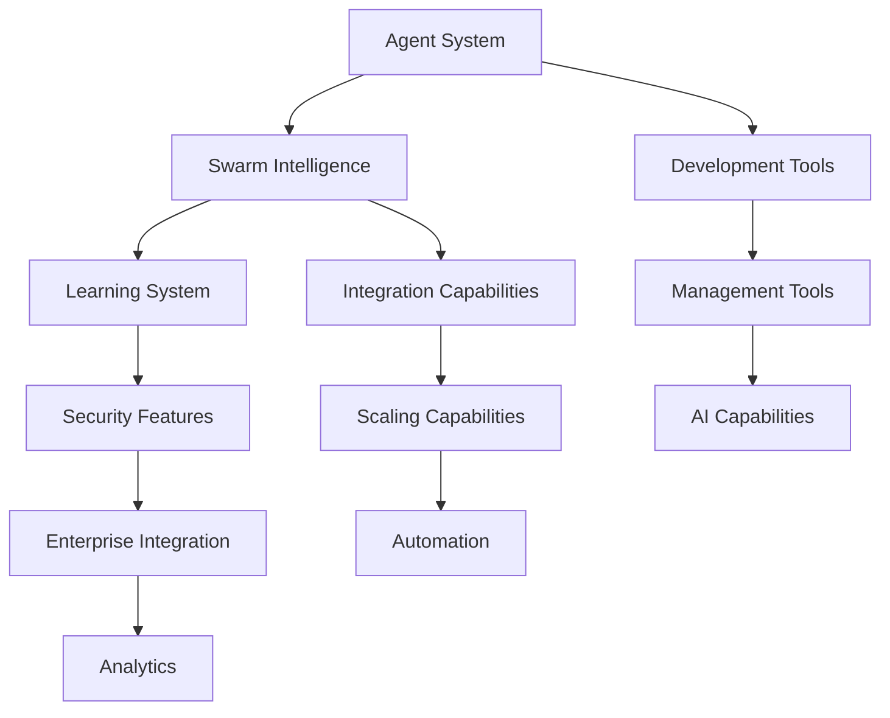

# Feature Roadmap

## Core Features

### 1. Agent System
#### Current
- Basic agent lifecycle management
- Simple task distribution
- Basic communication protocol
- Memory management

#### Planned
- Advanced task orchestration
- Dynamic agent creation
- Intelligent resource allocation
- Advanced memory optimization

### 2. Swarm Intelligence
#### Current
- Basic swarm coordination
- Simple task sharing
- Resource pooling
- Basic collective decision making

#### Planned
- Advanced swarm algorithms
- Dynamic load balancing
- Intelligent task distribution
- Emergent behavior patterns

### 3. Learning System
#### Current
- Basic pattern recognition
- Simple adaptative behavior
- Memory-based learning
- Basic knowledge sharing

#### Planned
- Advanced machine learning integration
- Neural network capabilities
- Distributed learning
- Knowledge synthesis

## Platform Features

### 4. Development Tools
#### Current
- Basic SDK
- Simple debugging tools
- Documentation generator
- Test framework

#### Planned
- Advanced development environment
- Real-time debugging
- Interactive documentation
- Comprehensive testing suite

### 5. Integration Capabilities
#### Current
- REST API support
- Basic webhooks
- Simple event system
- Standard protocols

#### Planned
- Advanced API gateway
- Custom protocol support
- Event streaming
- Third-party integrations

### 6. Security Features
#### Current
- Basic authentication
- Simple authorization
- Data encryption
- Access control

#### Planned
- Advanced security protocols
- Zero-trust architecture
- Compliance frameworks
- Security automation

## Enterprise Features

### 7. Management Tools
#### Current
- Basic monitoring
- Simple analytics
- Resource tracking
- Usage reporting

#### Planned
- Advanced monitoring suite
- Predictive analytics
- Resource optimization
- Comprehensive reporting

### 8. Scaling Capabilities
#### Current
- Horizontal scaling
- Load balancing
- Resource distribution
- Performance monitoring

#### Planned
- Auto-scaling
- Global distribution
- Edge computing support
- Advanced performance optimization

### 9. Enterprise Integration
#### Current
- SSO support
- Basic LDAP integration
- Audit logging
- Compliance reporting

#### Planned
- Advanced identity management
- Full enterprise integration
- Advanced audit capabilities
- Compliance automation

## Innovation Features

### 10. AI Capabilities
#### Current
- Basic AI models
- Simple predictions
- Pattern matching
- Learning algorithms

#### Planned
- Advanced AI integration
- Custom model support
- Distributed AI
- Cognitive capabilities

### 11. Automation
#### Current
- Basic workflow automation
- Task scheduling
- Simple triggers
- Action sequences

#### Planned
- Advanced automation
- Intelligent workflows
- Complex triggers
- Custom actions

### 12. Analytics
#### Current
- Basic metrics
- Simple dashboards
- Standard reports
- Data visualization

#### Planned
- Advanced analytics
- Custom dashboards
- Predictive insights
- Advanced visualization

## Feature Dependencies

## Implementation Priority

### High Priority
- Agent system improvements
- Security enhancements
- Performance optimization
- Enterprise integration

### Medium Priority
- Advanced AI capabilities
- Automation features
- Analytics improvements
- Development tools

### Low Priority
- Extended integrations
- Additional protocols
- Specialized features
- Experimental capabilities

## Feature Requests

### Community Requests
- Enhanced debugging tools
- Additional integration options
- More automation capabilities
- Extended API features

### Enterprise Requests
- Advanced security features
- Custom deployment options
- Enhanced monitoring
- Compliance tools

### Internal Requests
- Development efficiency
- Testing improvements
- Documentation updates
- Performance enhancements