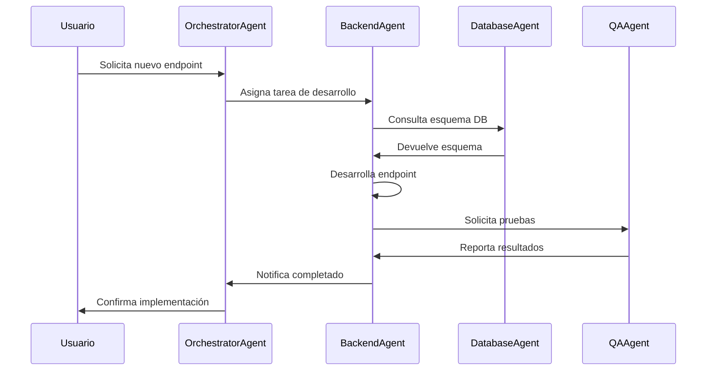
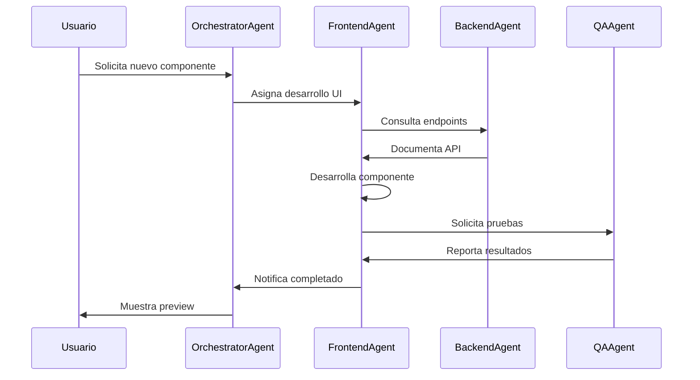
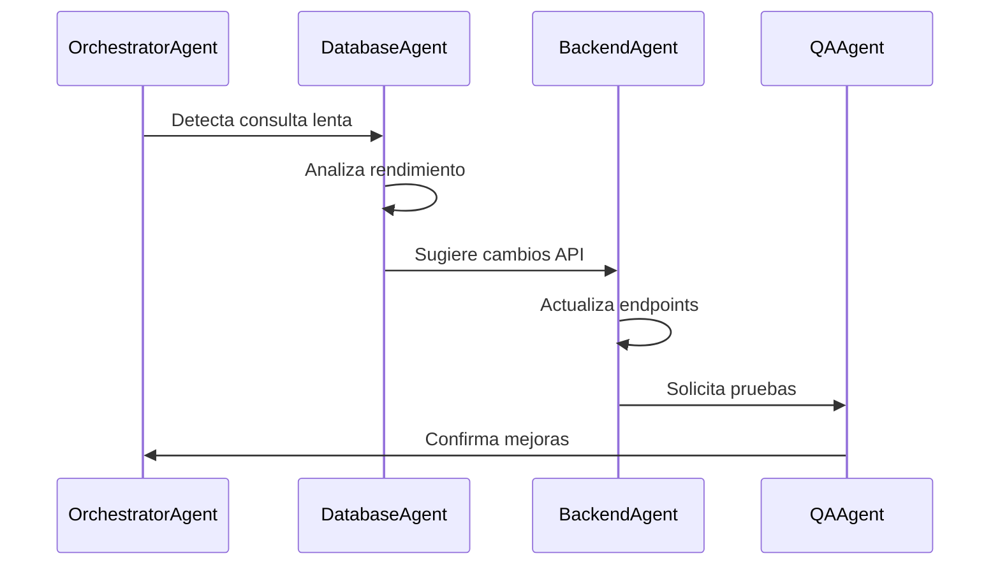
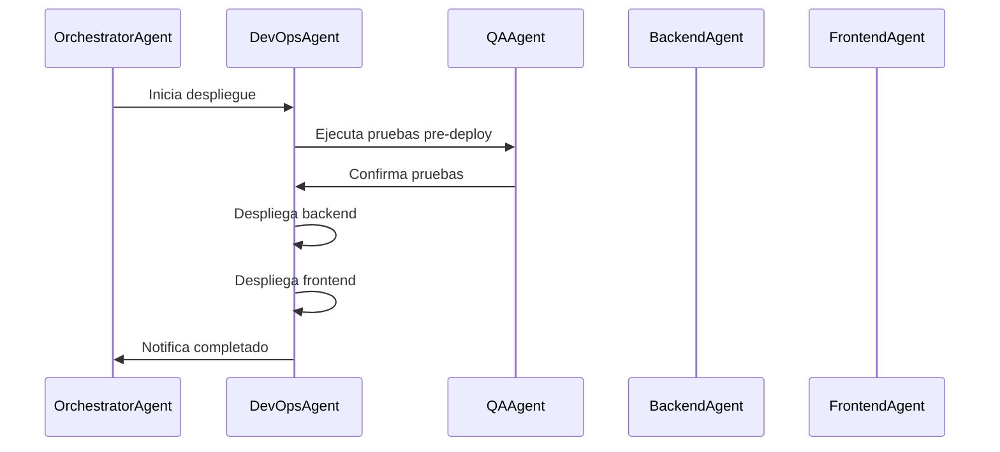
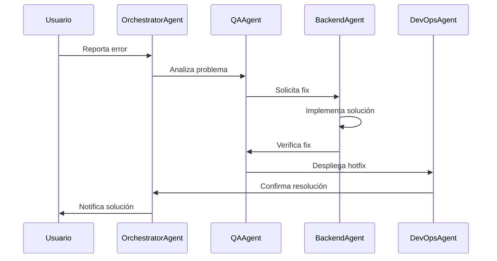
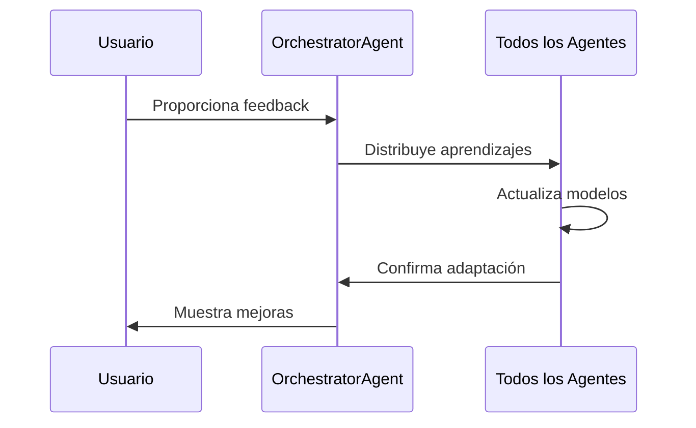

# Agent Collaboration Workflows

Este documento describe ejemplos prácticos de cómo los agentes colaboran en diferentes escenarios de desarrollo.

## 1. Desarrollo de Nueva Funcionalidad

### 1.1. Flujo: Crear un Nuevo Endpoint API

#### Detalles del Proceso
1. Usuario solicita crear endpoint `/api/properties/featured`
2. OrchestratorAgent analiza requerimientos y asigna tarea
3. BackendAgent:
   - Consulta esquema de base de datos
   - Implementa lógica de negocio
   - Genera documentación OpenAPI
4. QAAgent:
   - Ejecuta pruebas unitarias
   - Verifica documentación
   - Valida rendimiento
5. OrchestratorAgent confirma completado

## 2. Actualización de UI

### 2.1. Flujo: Implementar Nuevo Componente

#### Detalles del Proceso
1. Usuario solicita componente de listado de propiedades
2. FrontendAgent:
   - Analiza requisitos de UI/UX
   - Desarrolla componente React
   - Implementa pruebas E2E
3. BackendAgent proporciona documentación de API
4. QAAgent verifica:
   - Responsive design
   - Accesibilidad
   - Performance

## 3. Optimización de Base de Datos

### 3.1. Flujo: Optimizar Consultas

#### Detalles del Proceso
1. DatabaseAgent:
   - Analiza patrones de consulta
   - Optimiza índices
   - Sugiere cambios en ORM
2. BackendAgent adapta endpoints
3. QAAgent verifica mejoras de rendimiento

## 4. Despliegue Continuo

### 4.1. Flujo: Actualización en Producción

#### Detalles del Proceso
1. DevOpsAgent:
   - Verifica dependencias
   - Ejecuta pipeline CI/CD
   - Monitorea métricas
2. QAAgent realiza smoke tests
3. Sistema notifica resultado

## 5. Resolución de Incidentes

### 5.1. Flujo: Manejo de Errores

#### Detalles del Proceso
1. QAAgent:
   - Analiza logs
   - Reproduce error
   - Verifica fix
2. BackendAgent implementa solución
3. DevOpsAgent despliega hotfix

## 6. Mejora Continua

### 6.1. Flujo: Retroalimentación y Aprendizaje

#### Detalles del Proceso
1. Sistema recopila feedback
2. Agentes:
   - Actualizan preferencias
   - Mejoran respuestas
   - Optimizan workflows
3. Sistema valida mejoras
