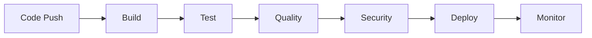
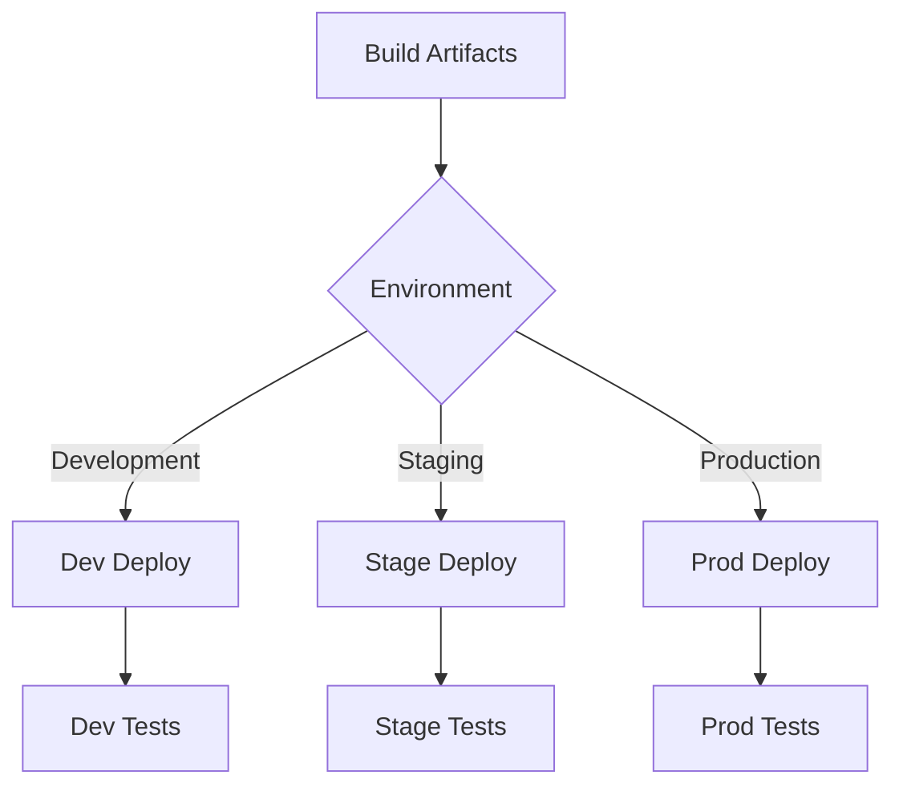

# CI/CD Pipeline

## 1. Pipeline Overview

### 1.1. Pipeline Stages


## 2. Build Stage

### 2.1. Build Process
- **Source Control**
  - Git hooks for pre-commit validation
  - Branch protection rules
  - Automated version tagging

- **Build Steps**
  ```yaml
  build:
    steps:
      - checkout
      - setup_dependencies
      - compile_code
      - create_artifacts
      - cache_dependencies
  ```

### 2.2. Build Agents
- BuildAgent monitors repository changes
- DependencyAgent manages package versions
- ArtifactAgent handles build outputs

## 3. Testing Stage

### 3.1. Test Suites
```yaml
test_suites:
  unit:
    runner: pytest
    coverage: 90%
    parallel: true
  
  integration:
    runner: playwright
    coverage: 85%
    services:
      - database
      - cache
      - message_queue
  
  e2e:
    runner: cypress
    browsers:
      - chrome
      - firefox
    viewport:
      - desktop
      - mobile
```

### 3.2. Test Orchestration
- TestOrchestratorAgent coordinates test execution
- ResultsCollectorAgent aggregates test results
- CoverageAgent tracks code coverage

## 4. Quality Gates

### 4.1. Code Quality
```python
class QualityGates:
    def __init__(self):
        self.checks = {
            'complexity': ComplexityCheck(),
            'duplication': DuplicationCheck(),
            'style': StyleCheck(),
            'coverage': CoverageCheck()
        }
    
    async def validate(self, build):
        results = []
        for check in self.checks.values():
            result = await check.run(build)
            results.append(result)
        return QualityReport(results)
```

### 4.2. Quality Metrics
- Cyclomatic complexity thresholds
- Code duplication limits
- Style conformance
- Test coverage requirements

## 5. Security Scanning

### 5.1. Security Checks
```yaml
security_scan:
  static_analysis:
    - dependency_check
    - code_scanning
    - secret_detection
  
  dynamic_analysis:
    - penetration_testing
    - vulnerability_scan
    - compliance_check
```

### 5.2. Security Agents
- SecurityScanAgent performs automated scans
- VulnerabilityAgent analyzes security reports
- ComplianceAgent ensures security standards

## 6. Deployment

### 6.1. Deployment Strategy


### 6.2. Deployment Process
```yaml
deployment:
  stages:
    - name: prepare
      steps:
        - validate_artifacts
        - check_dependencies
        - backup_current
    
    - name: deploy
      steps:
        - stop_services
        - update_artifacts
        - migrate_database
        - start_services
    
    - name: verify
      steps:
        - health_check
        - smoke_tests
        - performance_check
```

## 7. Monitoring

### 7.1. Metrics Collection
```python
class MonitoringSystem:
    def __init__(self):
        self.collectors = {
            'performance': PerformanceCollector(),
            'errors': ErrorCollector(),
            'usage': UsageCollector(),
            'resources': ResourceCollector()
        }
    
    async def gather_metrics(self):
        metrics = {}
        for name, collector in self.collectors.items():
            metrics[name] = await collector.collect()
        return MonitoringReport(metrics)
```

### 7.2. Alerting
- Performance degradation alerts
- Error rate thresholds
- Resource utilization warnings
- Security incident notifications

## 8. Pipeline Configuration

### 8.1. GitHub Actions
```yaml
name: CI/CD Pipeline

on:
  push:
    branches: [ main, develop ]
  pull_request:
    branches: [ main ]

jobs:
  build:
    runs-on: ubuntu-latest
    steps:
      - uses: actions/checkout@v2
      - name: Set up Python
        uses: actions/setup-python@v2
      - name: Install dependencies
        run: |
          python -m pip install --upgrade pip
          pip install -r requirements.txt
      - name: Run tests
        run: pytest
      - name: Build and deploy
        if: github.ref == 'refs/heads/main'
        run: |
          ./deploy.sh
```

### 8.2. Environment Variables
```yaml
environment:
  development:
    DATABASE_URL: ${DEV_DB_URL}
    API_KEY: ${DEV_API_KEY}
    DEBUG: true
  
  staging:
    DATABASE_URL: ${STAGE_DB_URL}
    API_KEY: ${STAGE_API_KEY}
    DEBUG: false
  
  production:
    DATABASE_URL: ${PROD_DB_URL}
    API_KEY: ${PROD_API_KEY}
    DEBUG: false
```

## 9. Pipeline Metrics

### 9.1. Performance Metrics
- Build time
- Test execution time
- Deployment duration
- Recovery time

### 9.2. Quality Metrics
- Test coverage
- Code quality scores
- Security vulnerabilities
- Deployment success rate

## 10. Troubleshooting

### 10.1. Common Issues
- Build failures
- Test flakiness
- Deployment rollbacks
- Performance degradation

### 10.2. Resolution Steps
```yaml
troubleshooting:
  build_failure:
    - check_logs
    - verify_dependencies
    - clean_cache
    - rebuild
  
  test_failure:
    - analyze_logs
    - check_test_data
    - verify_environment
    - rerun_tests
  
  deployment_failure:
    - verify_artifacts
    - check_permissions
    - validate_config
    - rollback_deploy