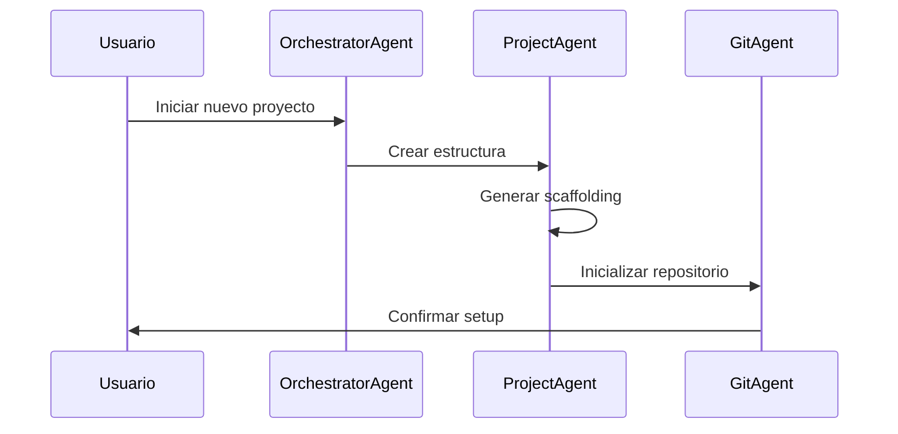
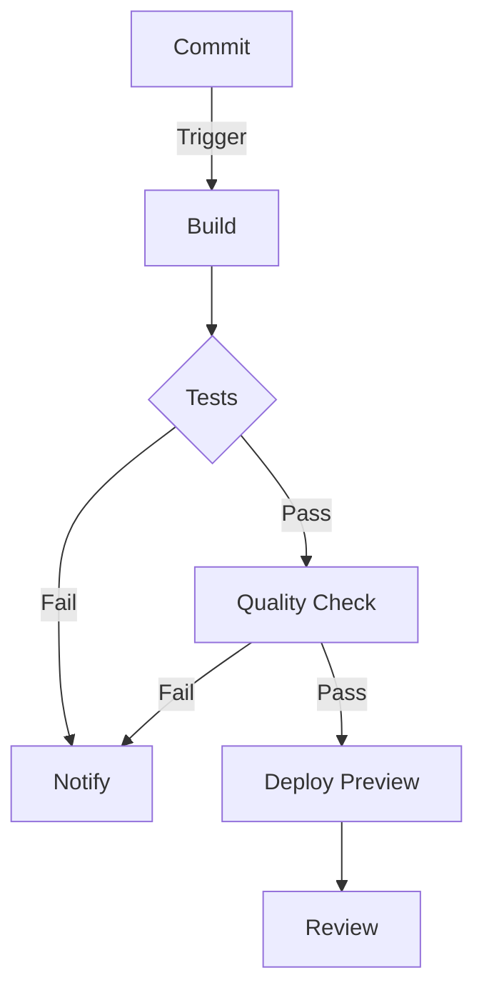
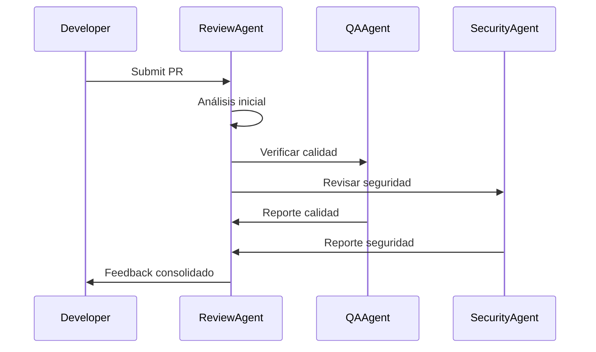
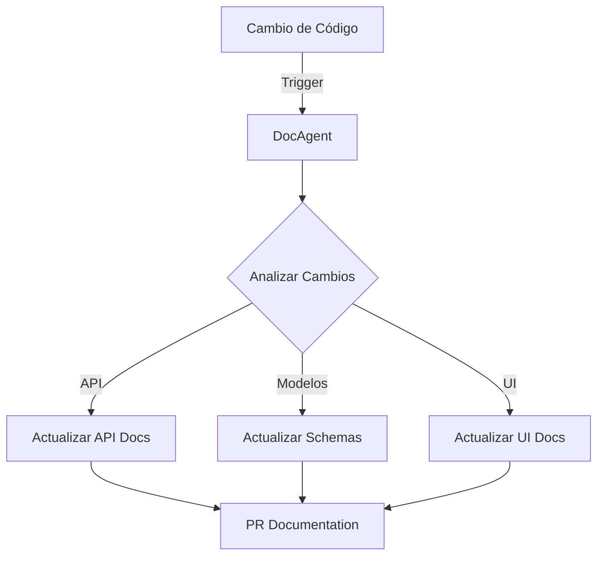

# Development Workflows

## 1. Flujo de Desarrollo con Agentes

### 1.1. Inicio de Proyecto


### 1.2. Proceso de Desarrollo
1. **Planificación**
   - OrchestratorAgent analiza requerimientos
   - Divide trabajo entre agentes especializados
   - Establece dependencias y prioridades

2. **Implementación**
   - Agentes trabajan en paralelo
   - Coordinación automática
   - Feedback continuo

3. **Revisión**
   - QAAgent verifica calidad
   - Retroalimentación a desarrolladores
   - Mejoras iterativas

## 2. Workflows Específicos

### 2.1. Feature Development
```yaml
workflow:
  name: Nueva Funcionalidad
  steps:
    - name: Análisis
      agent: ArchitectAgent
      actions:
        - analizar_requerimientos
        - diseñar_solución
        - crear_tareas

    - name: Desarrollo
      agents: [BackendAgent, FrontendAgent]
      actions:
        - implementar_código
        - escribir_tests
        - documentar_cambios

    - name: Revisión
      agent: QAAgent
      actions:
        - ejecutar_tests
        - verificar_cobertura
        - validar_documentación

    - name: Deployment
      agent: DevOpsAgent
      actions:
        - preparar_release
        - deploy_staging
        - monitorear_métricas
```

### 2.2. Bug Fixing
```yaml
workflow:
  name: Corrección de Bug
  steps:
    - name: Diagnóstico
      agent: QAAgent
      actions:
        - reproducir_error
        - analizar_logs
        - identificar_causa

    - name: Corrección
      agent: DeveloperAgent
      actions:
        - implementar_fix
        - actualizar_tests
        - documentar_solución

    - name: Verificación
      agents: [QAAgent, SecurityAgent]
      actions:
        - validar_fix
        - revisar_seguridad
        - aprobar_cambios
```

## 3. Integración Continua

### 3.1. Pipeline de CI


### 3.2. Roles de Agentes
```python
class CIPipeline:
    def __init__(self):
        self.stages = {
            'build': BuildAgent(),
            'test': TestAgent(),
            'quality': QualityAgent(),
            'deploy': DeployAgent(),
            'notify': NotificationAgent()
        }

    async def run(self, commit):
        for stage in self.stages.values():
            result = await stage.process(commit)
            if not result.success:
                await self.handle_failure(stage, result)
                break
```

## 4. Code Review

### 4.1. Proceso Automatizado


### 4.2. Criterios de Review
```python
class ReviewCriteria:
    def __init__(self):
        self.checks = [
            CodeStyleCheck(),
            SecurityCheck(),
            PerformanceCheck(),
            TestCoverageCheck(),
            DocumentationCheck()
        ]

    async def evaluate(self, pr):
        results = []
        for check in self.checks:
            result = await check.run(pr)
            results.append(result)
        return ReviewReport(results)
```

## 5. Gestión de Releases

### 5.1. Proceso de Release
```yaml
release_process:
  steps:
    - name: Preparación
      actions:
        - freeze_features
        - update_version
        - generate_changelog

    - name: Validación
      actions:
        - run_integration_tests
        - validate_documentation
        - check_dependencies

    - name: Deployment
      actions:
        - deploy_staging
        - run_smoke_tests
        - deploy_production

    - name: Post-Release
      actions:
        - monitor_metrics
        - collect_feedback
        - update_documentation
```

### 5.2. Automatización
```python
class ReleaseManager:
    def __init__(self):
        self.agents = {
            'version': VersionAgent(),
            'test': TestAgent(),
            'deploy': DeployAgent(),
            'monitor': MonitorAgent()
        }

    async def prepare_release(self, version):
        await self.agents['version'].bump(version)
        await self.agents['test'].validate()
        await self.agents['deploy'].stage()
        return await self.agents['monitor'].check_health()
```

## 6. Documentación

### 6.1. Mantenimiento Automático


### 6.2. Sistema de Documentación
```python
class DocumentationSystem:
    def __init__(self):
        self.generators = {
            'api': OpenAPIGenerator(),
            'models': SchemaGenerator(),
            'ui': UIDocsGenerator()
        }

    async def update(self, changes):
        tasks = []
        for change in changes:
            generator = self.get_generator(change)
            tasks.append(generator.update(change))
        return await asyncio.gather(*tasks)
```

## 7. Métricas y Análisis

### 7.1. Recolección de Datos
```python
class MetricsCollector:
    def __init__(self):
        self.metrics = {
            'performance': PerformanceMetrics(),
            'quality': CodeQualityMetrics(),
            'productivity': ProductivityMetrics()
        }

    async def collect(self):
        data = {}
        for name, collector in self.metrics.items():
            data[name] = await collector.gather()
        return MetricsReport(data)
```

### 7.2. Visualización
```typescript
interface MetricsDashboard {
    components: {
        timeline: TimelineChart;
        quality: QualityGauge;
        performance: PerformanceGraph;
        productivity: ProductivityMatrix;
    };

    async refresh(): Promise<void> {
        const data = await this.fetchMetrics();
        this.components.timeline.update(data.timeline);
        this.components.quality.update(data.quality);
        // ...más actualizaciones
    }
}